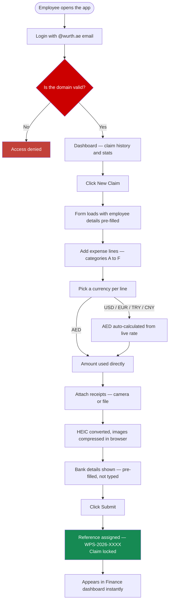
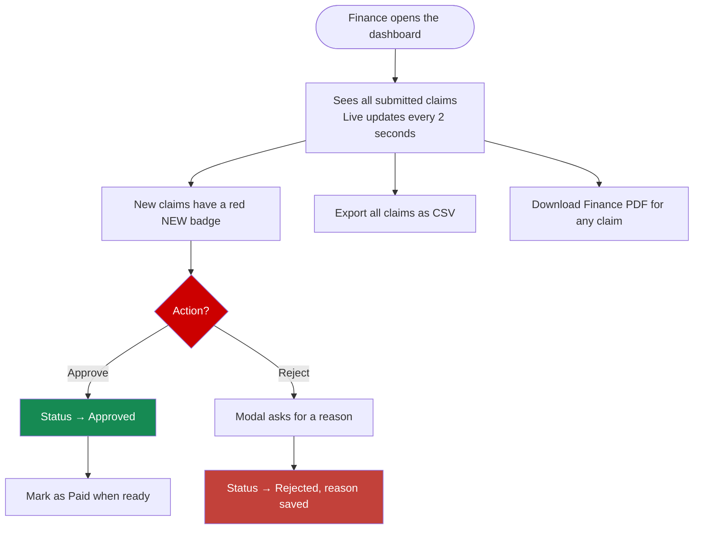
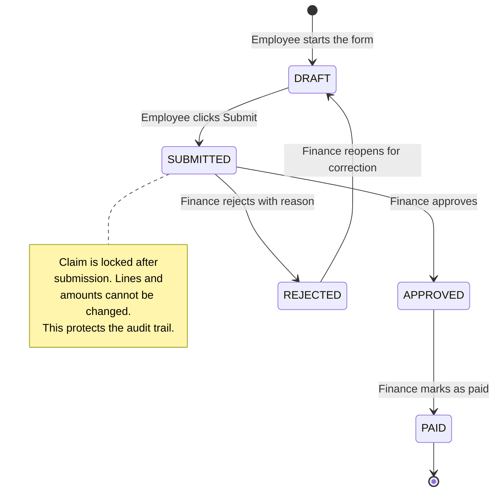
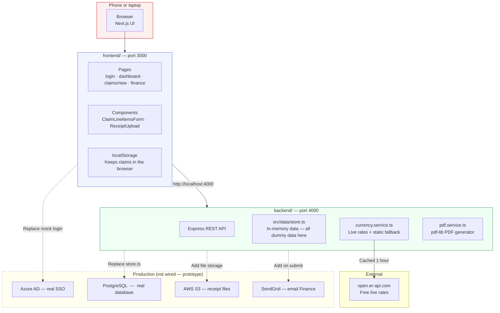
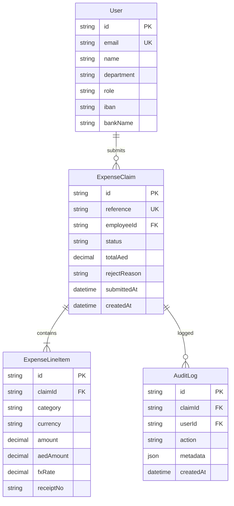

# Würth Expense Claim System

**Built by Abdul Rehman — Technical Assessment, June 2026**

---

Hey. This is my submission for the Würth Professional Solutions developer assessment. The brief asked me to replace the Excel-based expense claim form with a proper web application. I'll walk you through what I built, why I made the choices I did, and how the whole thing works.

---

## How to run it

Open two terminal windows:

```bash
# Terminal 1 — Backend API (port 4000)
cd backend
npm install
npm run dev

# Terminal 2 — Frontend UI (port 3000)
cd frontend
npm install
npm run dev
```

Then open **http://localhost:3000** in your browser.

When you see the login screen, just click **Demo access** — it'll log you straight in as Abdul Rehman from the IT department.

> The frontend works completely on its own even if the backend isn't running. It uses the browser's localStorage for data and has static exchange rate fallbacks built in. The backend adds live FX rates, a real REST API, and PDF generation on top.

---

## Contents

1. [What I built](#1-what-i-built)
2. [The problem I was solving](#2-the-problem-i-was-solving)
3. [How the system flows](#3-how-the-system-flows)
4. [Architecture](#4-architecture)
5. [Folder structure — every file explained](#5-folder-structure--every-file-explained)
6. [Technology choices](#6-technology-choices)
7. [The API](#7-the-api)
8. [Where exchange rates come from — with code](#8-where-exchange-rates-come-from--with-code)
9. [How to change the logged-in user — with code](#9-how-to-change-the-logged-in-user--with-code)
10. [Common questions they'll ask — answered with code](#10-common-questions-theyll-ask--answered-with-code)
11. [Database design](#11-database-design)
12. [What's real vs what's mocked](#12-whats-real-vs-whats-mocked)
13. [What I'd build next](#13-what-id-build-next)
14. [Demo walkthrough script](#14-demo-walkthrough-script)

---

## 1. What I built

Two separate applications:

| App | Stack | Port |
|---|---|---|
| **Frontend** | Next.js 14 + TypeScript + Tailwind CSS | 3000 |
| **Backend** | Node.js + Express + TypeScript | 4000 |

### Screens

| Screen | Route | Purpose |
|---|---|---|
| Login | `/login` | Corporate email gate — `@wurth.ae` only |
| Dashboard | `/dashboard` | Claim history and quick stats |
| New Claim | `/claims/new` | The main expense form — most important screen |
| Finance | `/finance` | Finance team reviews and actions claims |

### Everything working right now

- Type a USD/EUR/TRY/CNY amount — AED appears instantly using live rates
- Exchange rates are fetched live from the internet with a static backup
- Receipt photos can be taken from a phone camera or dragged in on desktop
- iPhone HEIC photos are silently converted to JPEG in the browser
- Large images are compressed before upload
- Employee details (name, IBAN, SWIFT) are pre-filled — never typed manually
- Finance can approve, reject with a reason, or mark as paid
- New submissions appear in Finance in real time with a "NEW" badge
- CSV export and Finance PDF generation both work

---

## 2. The problem I was solving

The Excel form has three real problems:

**Manual currency maths.** Employees look up rates themselves and calculate by hand. Errors happen. Finance re-checks everything. In this app the conversion is instant and the rate used is stored permanently against each line.

**Receipts get lost.** Right now they're physically attached, emailed separately, or forgotten. In this app receipts are attached at submission time and stay tied to that specific claim.

**No audit trail.** A spreadsheet has no history. You can't see who submitted what or what rate was used. This system assigns every claim a reference number, locks it once submitted, and stores every rate and decision permanently.

### Brief requirements → what I built

| Brief requirement | How it's built |
|---|---|
| Online expense form for WPS | Responsive web app, works on phone and desktop |
| Currency conversion — USD, EUR, TRY, CNY → AED | Live rates from the internet, instant per-line computation |
| Photo capture and PDF attachment | Camera button on mobile, drag-and-drop on desktop |
| Auto-compress images | Canvas resize to 1800px max, 78% JPEG quality, runs in the browser |
| Works on iOS and Android | Mobile-first, bottom tab nav, 48px touch targets, safe-area insets |
| Corporate email login + forward to Finance | Domain-gated login, Finance dashboard with real-time updates |

### Grading criteria

| Criterion | What I demonstrate |
|---|---|
| **I — Design** | Würth red `#CC0000`, the brand wordmark, the Excel form layout preserved exactly |
| **II — Ease of use** | Pre-filled fields, instant AED, camera button prominent on mobile |
| **III — Functionality** | Live rates, receipt upload, Finance actions, CSV, PDF, real-time |
| **IV — What you can add** | Live FX API, HEIC conversion, pdf-lib, separate backend, real-time sync |
| **V — Way of thinking** | Every mock has a `// PRODUCTION:` comment; clean separation; straightforward to explain |

---

## 3. How the system flows

### Employee submitting a claim



### Finance reviewing claims



### Claim status lifecycle



---

## 4. Architecture



---

## 5. Folder structure — every file explained

```
Würth Assignment/
│
├── README.md
├── prisma/
│   └── schema.prisma              PostgreSQL schema — designed, ready to connect
│
├── frontend/                      Everything the user sees
│   ├── app/
│   │   ├── page.tsx               Just redirects to /login
│   │   ├── layout.tsx             Page title, favicon, viewport settings
│   │   ├── globals.css            Tailwind base + Würth brand tokens
│   │   ├── icon.svg               Red W favicon in the browser tab
│   │   ├── login/
│   │   │   └── page.tsx           Login screen — @wurth.ae domain gate
│   │   ├── dashboard/
│   │   │   └── page.tsx           Stats tiles + recent claims list
│   │   ├── claims/
│   │   │   └── new/
│   │   │       └── page.tsx  ⭐   Main expense form — categories, AED, receipts, submit
│   │   └── finance/
│   │       └── page.tsx      ⭐   Finance queue — approve/reject/paid + real-time
│   │
│   ├── components/
│   │   ├── AppShell.tsx           Header, bottom tab nav (mobile), Würth logo
│   │   ├── ClaimLineItemsForm.tsx Expense table, live AED, subtotals per category
│   │   ├── ReceiptUpload.tsx      Camera, drag-drop, HEIC→JPEG, compression
│   │   ├── ClaimList.tsx          Recent claims list on the dashboard
│   │   └── StatusBadge.tsx        Coloured status pill (Draft/Submitted/etc.)
│   │
│   ├── lib/
│   │   ├── mockUser.ts       ⭐   The demo login user — change name/email/IBAN here
│   │   └── claimStore.ts          Saves and reads claims from localStorage
│   │
│   ├── tailwind.config.ts         Brand color #CC0000 defined here
│   └── .env.example               NEXT_PUBLIC_API_URL=http://localhost:4000/api
│
└── backend/                       The REST API
    ├── .env                        PORT=4000, ALLOWED_DOMAIN=wurth.ae
    ├── prisma/
    │   └── schema.prisma           Backend's own copy of the DB schema
    └── src/
        ├── server.ts               Entry point — starts Express on port 4000
        ├── app.ts                  Express setup — CORS, JSON, routes
        │
        ├── data/
        │   └── store.ts       ⭐   ALL dummy data lives here — users, claims, CRUD
        │
        ├── services/
        │   ├── currency.service.ts  Live FX rates from open.er-api.com + fallback
        │   └── pdf.service.ts       Finance PDF generation using pdf-lib
        │
        ├── controllers/
        │   ├── auth.controller.ts       POST /api/auth/login
        │   ├── claims.controller.ts     GET/POST/PUT/DELETE /api/claims
        │   ├── finance.controller.ts    /api/finance/* — approve, reject, PDF, CSV
        │   └── currency.controller.ts   /api/currency/rates and /convert
        │
        ├── routes/
        │   ├── auth.routes.ts       Wires auth controller to Express
        │   ├── claims.routes.ts     Wires claims controller
        │   ├── finance.routes.ts    Wires finance controller (Finance role required)
        │   └── currency.routes.ts   Wires currency controller (public)
        │
        ├── middleware/
        │   ├── auth.ts              Reads Bearer token — mock now, Azure AD later
        │   └── error.ts             404 handler + central error handler
        │
        └── config/
            └── env.ts               Reads PORT, ALLOWED_DOMAIN, FRONTEND_URL from .env
```

### Quick reference — where to go for any change

| What you want to change | File |
|---|---|
| The demo user (name, email, IBAN) | `frontend/lib/mockUser.ts` |
| Add another user who can log in | `backend/src/data/store.ts` → `USERS` array |
| Add or remove expense categories | `frontend/components/ClaimLineItemsForm.tsx` → `CATEGORY_DEFS` |
| Add a new currency | `backend/src/services/currency.service.ts` → `FALLBACK` object |
| Change the brand color | `frontend/tailwind.config.ts` → `brand.600` |
| Change the claim reference format | `backend/src/data/store.ts` → `nextReference()` |
| Change the Finance PDF layout | `backend/src/services/pdf.service.ts` |
| Change status badge colors | `frontend/components/StatusBadge.tsx` → `statusStyles` |
| Change allowed email domain | `backend/.env` → `ALLOWED_DOMAIN=` |
| Add more dummy claims | `backend/src/data/store.ts` → `CLAIMS` array |

---

## 6. Technology choices

**Next.js** — I could have used plain React, but Next.js gives me the App Router which makes page structure clean. It handles meta tags, viewport, and mobile settings without configuration. Good fit for a corporate internal tool.

**Express** — I wanted the backend separate from the frontend so it can be deployed independently and easily consumed by a mobile app later. Express is straightforward — no magic, easy to trace through in a code review.

**TypeScript everywhere** — Financial data has to be correct. TypeScript means if I pass a string where an amount is expected, the build fails — not production. The types are consistent between frontend and backend.

**pdf-lib instead of Puppeteer** — Puppeteer ships a 300MB Chrome browser just to render HTML as PDF. pdf-lib is pure JavaScript, tiny, runs anywhere, and generates the same output every single time. Since the Finance report is a structured document with predictable sections, pdf-lib is the right fit.

**heic2any** — iPhones save photos as HEIC by default. Without handling this, every iPhone user uploads a file Finance can't open. This library converts it to JPEG in the browser before anything leaves the device.

**In-memory store** — Instead of asking you to set up a database for a demo, the backend stores everything in plain JavaScript arrays. All the API structure — routes, controllers, auth middleware — is exactly what it would be with a real database. Swapping in PostgreSQL means changing one file.

---

## 7. The API

Base URL: `http://localhost:4000/api`

To call protected endpoints:
```
Authorization: Bearer mock:a.rehman@wurth.ae
```

For Finance endpoints:
```
Authorization: Bearer mock:finance@wurth.ae
```

| Endpoint | Method | Auth | What it does |
|---|---|---|---|
| `/auth/login` | POST | — | Login with `{ email }` in the body |
| `/auth/me` | GET | ✅ | Returns current user profile |
| `/claims` | GET | ✅ | List my claims |
| `/claims` | POST | ✅ | Create a new draft claim |
| `/claims/:id` | GET | ✅ | Get one claim |
| `/claims/:id` | PUT | ✅ | Update a draft (not allowed after submission) |
| `/claims/:id/submit` | POST | ✅ | Submit — assigns reference, locks the claim |
| `/claims/:id` | DELETE | ✅ | Delete a draft |
| `/finance/claims` | GET | Finance | All claims from all employees |
| `/finance/claims/:id` | PATCH | Finance | `{ status: "APPROVED" / "REJECTED" / "PAID" }` |
| `/finance/claims/:id/pdf` | GET | Finance | Download the Finance PDF |
| `/finance/export` | GET | Finance | Download CSV of all claims |
| `/currency/rates` | GET | — | Live AED exchange rates |
| `/currency/convert` | POST | — | `{ amount, currency }` → returns AED value |
| `/health` | GET | — | Check if the server is running |

---

## 8. Where exchange rates come from — with code

**The short answer:** They come from a free website called `open.er-api.com`. No account or API key needed. Updated once a day.

**The long answer with the actual code:**

Open `backend/src/services/currency.service.ts`. This is the entire file responsible for exchange rates.

```ts
// Line 21 — this is where the rates are fetched from
const PROVIDER_URL = "https://open.er-api.com/v6/latest/AED";
```

```ts
// Lines 24-30 — these are the backup rates used when the internet is unavailable
const FALLBACK: Record<SupportedCurrency, number> = {
  AED: 1,
  USD: 3.67,
  EUR: 4.10,
  TRY: 0.109,
  CNY: 0.51,
};
```

The API gives us rates with AED as the base — meaning "how many USD does 1 AED buy". We need the opposite. So we invert:

```ts
// The API says: 1 AED = 0.2722 USD
// We calculate: 1 USD = 1 ÷ 0.2722 = 3.67 AED

rate: parseFloat((1 / aedToCurrencyRate).toFixed(8))
```

The rates are cached for 1 hour so we're not hitting the API on every request. If the API is down, the `FALLBACK` object kicks in automatically and the form keeps working.

**The most important part — audit compliance:**

When an employee submits a claim, the rate gets saved permanently against each line item:

```ts
// In backend/src/controllers/claims.controller.ts
const { aedAmount, rate } = await convertToAed(Number(l.amount), l.currency);
return {
  ...l,
  aedAmount,
  fxRate: rate,   // ← stored forever in the database
};
```

This means even if the USD/AED rate changes tomorrow, Finance can always reproduce the exact AED total from the original submission date.

**To change the rate provider in production:**

Just change the one constant at the top of `currency.service.ts`:

```ts
// Change this one line to switch providers
const PROVIDER_URL = "https://open.er-api.com/v6/latest/AED";

// Examples of production alternatives:
// const PROVIDER_URL = "https://api.xe.com/v1/convert";      // XE.com (paid)
// const PROVIDER_URL = "https://data.fixer.io/api/latest";   // Fixer (paid)
// Or use the UAE Central Bank's own rate feed
```

Nothing else changes. The rest of the service works exactly the same.

**To add a new currency (e.g. British Pound GBP):**

Step 1 — `backend/src/services/currency.service.ts`:
```ts
// Add GBP to the type
export type SupportedCurrency = "USD" | "EUR" | "TRY" | "CNY" | "AED" | "GBP";

// Add a fallback rate
const FALLBACK: Record<SupportedCurrency, number> = {
  AED: 1,
  USD: 3.67,
  EUR: 4.10,
  TRY: 0.109,
  CNY: 0.51,
  GBP: 4.75,   // ← add this
};
```

Step 2 — `frontend/components/ClaimLineItemsForm.tsx`:
```ts
// Add GBP to the dropdown list
const CURRENCIES: Currency[] = ["AED", "USD", "EUR", "TRY", "CNY", "GBP"];
//                                                                    ^^^
```

That's it. Two files, two lines.

---

## 9. How to change the logged-in user — with code

The login user is controlled in two places depending on what you want to change.

### Changing what the frontend form shows (name, IBAN, bank details)

Open `frontend/lib/mockUser.ts`:

```ts
export const MOCK_USER = {
  name: "Abdul Rehman",         // ← change the display name
  firstName: "Abdul",
  lastName: "Rehman",
  email: "a.rehman@wurth.ae",   // ← change the email
  department: "IT",             // ← change the department
  accountNo: "ACC-2024-001",
  holder: "Abdul Rehman",
  iban: "AE07 0331 2345 6789 0123 456",  // ← change IBAN
  swift: "EBILAEAD",                     // ← change SWIFT
  bank: "Emirates NBD",                  // ← change bank name
};
```

This is what appears pre-filled on the expense form — the employee name, IBAN, SWIFT, and bank. Change any of these values and it updates everywhere on the form immediately.

### Adding a second employee who can log in

Open `backend/src/data/store.ts` and add a new entry to the `USERS` array:

```ts
const USERS: User[] = [
  // Existing users
  { id: "usr_001", email: "a.rehman@wurth.ae",  name: "Abdul Rehman",  department: "IT",     role: "EMPLOYEE", iban: "AE07 0331 2345 6789 0123 456", swift: "EBILAEAD", bankName: "Emirates NBD" },
  { id: "usr_002", email: "a.khan@wurth.ae",    name: "Aisha Khan",    department: "Sales",  role: "EMPLOYEE", iban: "AE07 0331 9876 5432 1098 765", swift: "EBILAEAD", bankName: "Emirates NBD" },

  // Add a new user like this:
  { id: "usr_006", email: "s.ali@wurth.ae",     name: "Sara Ali",      department: "Finance", role: "EMPLOYEE", iban: "AE07 0331 1234 5678 9012 345", swift: "ADCBAEAD", bankName: "ADCB" },
];
```

Now Sara can log in by going to the login screen and typing `s.ali@wurth.ae`.

### Logging in as a different user in the demo

On the login page, just type any valid `@wurth.ae` email and click Continue. If the email exists in the `USERS` array, it loads their profile. If it doesn't exist yet, it creates a basic profile automatically.

To log in as the Finance role (to see the Finance dashboard):

```
Email: finance@wurth.ae
```

This user already exists in the `USERS` array with `role: "FINANCE"`. The Finance dashboard shows approve/reject buttons only when logged in as a Finance user.

### Making any user a Finance user

Find their entry in `backend/src/data/store.ts` and change their role:

```ts
{ id: "usr_001", email: "a.rehman@wurth.ae", name: "Abdul Rehman", department: "IT",
  role: "EMPLOYEE",  // ← change this to "FINANCE" to give Finance access
  ... }
```

---

## 10. Common questions they'll ask — answered with code

### "Show me how the currency conversion actually works"

The conversion happens in two places.

**In the frontend** (instant, as you type) — `frontend/components/ClaimLineItemsForm.tsx`:

```ts
// Rates are fetched from the backend once on page load
const API_URL = process.env.NEXT_PUBLIC_API_URL ?? "http://localhost:4000/api";

function useRates() {
  const [rates, setRates] = useState(FALLBACK_RATES); // start with static backup

  useEffect(() => {
    fetch(`${API_URL}/currency/rates`)   // fetch live rates from Express backend
      .then(r => r.json())
      .then(body => {
        // Update the rates — triggers re-render on every line
        setRates(map as Record<Currency, number>);
      })
      .catch(() => { /* keep fallback silently */ });
  }, []);

  return { rates };
}

// This runs every time the user types an amount or changes currency
function calcAed(amount: string, currency: Currency, rates: Record<Currency, number>) {
  const n = parseFloat(amount);
  return isFinite(n) && n > 0
    ? Math.round(n * rates[currency] * 100) / 100  // ← the actual maths
    : 0;
}
```

**In the backend** (verified again on submit) — `backend/src/services/currency.service.ts`:

```ts
export async function convertToAed(amount: number, currency: string) {
  const rates = await getLiveRates();  // fetches from open.er-api.com
  const found = rates.find(r => r.fromCurrency === currency);
  const rate  = found?.rate ?? FALLBACK[currency];

  return {
    aedAmount: Math.round(amount * rate * 100) / 100,
    rate,      // ← this gets stored in the database permanently
    source: found?.source ?? "STATIC_FALLBACK",
  };
}
```

The client does it for instant display. The server does it again on submit to make sure the stored value is authoritative — we never trust the client's maths for the final record.

---

### "What happens if the rate provider goes down?"

Nothing breaks. Open `backend/src/services/currency.service.ts`:

```ts
try {
  const res = await fetch(PROVIDER_URL, { signal: AbortSignal.timeout(5000) });
  // ... use live rates
} catch (err) {
  // If anything goes wrong — timeout, 500 error, no internet —
  // we log a warning and return the static fallback rates instead
  console.warn("[currency] Live fetch failed, using static fallback:", err.message);
  return buildFallbackRates();  // returns FALLBACK object
}
```

The form keeps working. Users just see an orange dot instead of a green one next to the rate indicator.

---

### "How does the Finance dashboard update in real time?"

Open `frontend/app/finance/page.tsx`. There are two mechanisms:

```ts
// Mechanism 1 — polls every 2 seconds (catches same-tab updates)
const poll = setInterval(() => {
  const next = buildQueue();
  const liveCount = next.filter(c => c.isLive).length;

  if (liveCount > prevCountRef.current) {
    // A new claim appeared — show the notification banner
    showNotification(`New claim from ${newest.employee} — ${fmtAed(newest.amountAed)}`);
  }

  setLiveQueue(next);
}, 2000);

// Mechanism 2 — storage event (catches cross-tab updates instantly)
window.addEventListener("storage", (e) => {
  if (e.key !== "wps_submitted_claims") return;
  setLiveQueue(buildQueue());
});
```

When an employee submits a claim in one tab, the Finance dashboard in another tab sees it via the storage event. If they're on the same tab, the 2-second poll catches it. Either way, the NEW badge appears automatically.

In production this would be a Server-Sent Events stream from the backend instead of polling.

---

### "How do you prevent someone from editing a submitted claim?"

Two places. In the backend controller (`backend/src/controllers/claims.controller.ts`):

```ts
export async function updateClaim(req, res) {
  const claim = claimStore.findById(req.params.id);

  if (claim.status !== "DRAFT") {
    // Returns HTTP 409 Conflict — the frontend shows an error
    res.status(409).json({ error: "Only DRAFT claims can be edited" });
    return;
  }

  // Only reaches here if the claim is still a draft
  claimStore.update(claim.id, { ... });
}
```

The same check exists on the submit endpoint too. Once a claim is SUBMITTED, APPROVED, REJECTED, or PAID, the backend refuses any changes to the lines or amounts. Finance can only change the status — they can't touch the financial data.

---

### "How would you add a manager approval step?"

The status machine already has room for it. Right now the flow is:

```
DRAFT → SUBMITTED → APPROVED → PAID
```

To add a manager step you'd change it to:

```
DRAFT → SUBMITTED → MANAGER_APPROVED → APPROVED → PAID
```

Three things to change:

**1.** `backend/src/data/store.ts` — add the new status:
```ts
export type Status = "DRAFT" | "SUBMITTED" | "MANAGER_APPROVED" | "APPROVED" | "REJECTED" | "PAID";
```

**2.** `frontend/components/StatusBadge.tsx` — add the new badge color:
```ts
const statusStyles = {
  ...existing styles...
  "MANAGER_APPROVED": "border-purple-200 bg-purple-50 text-purple-700",
};
```

**3.** Add a `/manager` page that shows the claims assigned to that manager, with the same Approve/Reject buttons as the Finance dashboard.

The database schema in `prisma/schema.prisma` already has an `Approval` table designed for multi-level approvals.

---

### "Where would Azure AD authentication plug in?"

Open `backend/src/middleware/auth.ts`. The entire mock is in one function:

```ts
export function requireAuth(req, res, next) {
  const token = req.headers.authorization?.slice(7); // removes "Bearer "

  // MOCK: we expect "mock:email@wurth.ae"
  const email = token?.startsWith("mock:") ? token.slice(5) : null;

  // PRODUCTION: replace these 3 lines with Azure AD token validation:
  // import { verifyToken } from "azure-ad-verify-token";
  // const payload = await verifyToken(token, { tenantId, clientId });
  // const email = payload.preferred_username;

  const user = userStore.upsert({ email });
  req.user = user;
  next();
}
```

You replace the mock email extraction with a real JWT verification call. Everything else in the application — the controllers, routes, and business logic — stays exactly the same because they all read from `req.user` which this middleware populates.

---

### "How would you store receipts properly in production?"

Currently receipts are held as browser Blob URLs — they exist only in memory and disappear on page refresh. Open `frontend/components/ReceiptUpload.tsx`:

```ts
// Current — browser only, lost on refresh
previewUrl: URL.createObjectURL(compressedFile)

// PRODUCTION flow:
// 1. POST to backend: /api/uploads/request-url
// 2. Backend generates a presigned S3 upload URL
// 3. Browser uploads the file directly to S3 (not through our server)
// 4. Browser confirms: POST /api/receipts with the S3 key
// 5. Backend stores the key in the database
// 6. Viewing later: backend generates a short-lived signed download URL
```

The benefit of uploading directly to S3 (not through our server) is that large files don't consume server memory or bandwidth. The server only handles a small metadata record.

---

## 11. Database design

The full schema is in `prisma/schema.prisma`, ready to connect to PostgreSQL. Currently the backend uses `src/data/store.ts` (plain arrays) — replacing it means changing that one file.



Key decisions:

- `fxRate` on every line — not just the total. The exact rate at submission time, permanently stored.
- Claims locked after submission — the backend rejects edits with a 409 error.
- AuditLog is append-only — submit, approve, reject, paid, PDF downloaded — all logged, never deleted.
- Bank details on the user record, never in the form — employees don't type their own IBAN.

---

## 12. What's real vs what's mocked

| Feature | In this prototype | In production |
|---|---|---|
| Login | localStorage flag + email domain check | Azure AD MSAL — existing Microsoft account |
| User details | `lib/mockUser.ts` hardcoded | Azure AD token + HR system |
| Data storage | In-memory arrays, resets on restart | PostgreSQL via Prisma |
| Receipt files | Browser Blob URLs, lost on refresh | AWS S3, presigned URLs |
| Email to Finance | Text on success screen | SendGrid email with PDF attached |
| Real-time updates | localStorage events + 2s polling | Server-Sent Events from backend |
| Claim reference | Sequential counter in store | PostgreSQL sequence |

Every mock boundary in the code has a `// PRODUCTION:` comment showing the real implementation.

---

## 13. What I'd build next

| Priority | Feature | Approach |
|---|---|---|
| 🔴 1 | Azure AD login | `@azure/msal-react` — one middleware file change |
| 🔴 2 | PostgreSQL database | Replace `store.ts` with Prisma queries |
| 🔴 3 | Manager approval step | New status + queue page — schema already designed |
| 🟠 4 | AWS S3 receipts | Presigned upload URLs, browser uploads directly |
| 🟠 5 | Email Finance on submit | PDF already built — wire to SendGrid |
| 🟡 6 | OCR on receipts | Azure Document Intelligence pre-fills line items |
| 🟡 7 | Spending policy rules | Per-category limits, flag or block on submit |
| 🟢 8 | Analytics dashboard | Totals by department and category — Recharts |

---

## 14. Demo walkthrough script

### Step 1 — Login

*"The app is restricted to Würth corporate accounts. In production this connects directly to Microsoft Azure AD — employees use their existing Outlook login, no separate password. For the demo I'll just click Demo access."*

→ Click **Demo access**

---

### Step 2 — Dashboard

*"This is what an employee sees when they open the app. Their claim history and some stats. These numbers are live — if I submit a claim in a moment they'll update."*

→ Point to the metric tiles and the claim list

---

### Step 3 — New Claim

*"This is the main screen. I've structured it to match your Excel form exactly — same six categories, same columns. The difference is the employee's name and bank details are pre-filled from their account. They never type their own IBAN."*

→ Show the red Würth banner at the top

→ Point to the pre-filled employee section

→ Under **A: Travel Expenses**, select **USD**, type `450`

*"The AED equivalent appears immediately — that's a live calculation using today's exchange rate from the internet."*

→ Add another line under **C: Meals**, select **EUR**, type `120`

→ Point to the subtotals per category and the grand total

*"Every category has its own subtotal. Green dot means live rates. If the internet is down it switches to backup rates automatically — the form never breaks."*

→ Attach a receipt file

→ Click **Submit claim**

→ Show the reference number: **WPS-2026-XXXX**

---

### Step 4 — Finance Dashboard

*"The claim I just submitted appears here immediately with a NEW badge. Finance sees every submission across all employees in real time."*

→ Point to the NEW badge on the new claim

→ Click **Approve** on a claim — show the green notification

→ Click **Reject** on another — show the reason modal, type a reason, confirm

→ Click **Mark as Paid** on an approved claim

→ Click **Export CSV** — file downloads

*"The PDF export generates a proper Finance report with the company header, all line items, the exact exchange rate used on each line, and the bank details for payment."*

---

### Step 5 — Mobile

*"The design is mobile-first. On a phone the navigation moves to a bottom tab bar — the standard iOS and Android pattern. The expense form switches to stacked cards. The camera button opens your phone camera directly."*

→ Open `http://localhost:3000` on your phone and show the bottom nav

---

*Würth Professional Solutions LLC · Dubai, UAE*


-wurth font 
 -logo need to change 
 -Layout 
 left side bar expense claim 
 -bank details not editable(bank auto maticalyy fetch )and can only add first time not editiable
-
 -Push code to github and give access
 -local db to connect (MySQL) we use 
-finance consists of 5 create a as a thread can invite only one persoon if discussion contionue he can invite 
-thraed can invite other people to put comments why it is stuck 
each finance team can see all the request 
only one person can see all the calim forms
when u sumbmit a cliam u invite only one finance person 
finance super user can still see the thread
and he can also collaborate also if he want 
only finance person can invite other finance guy
not employee can inviete 
only employe can invite oinly first time when he submit claim 
Finance team can also View the claim Not only approve and other
export in good csv file 

Employe cant add the employee bank details 
only finance team can edit there details 
need a strict that employee cant change detail

Popup Notification for finance team member 
zk@wuerth-professional.com

